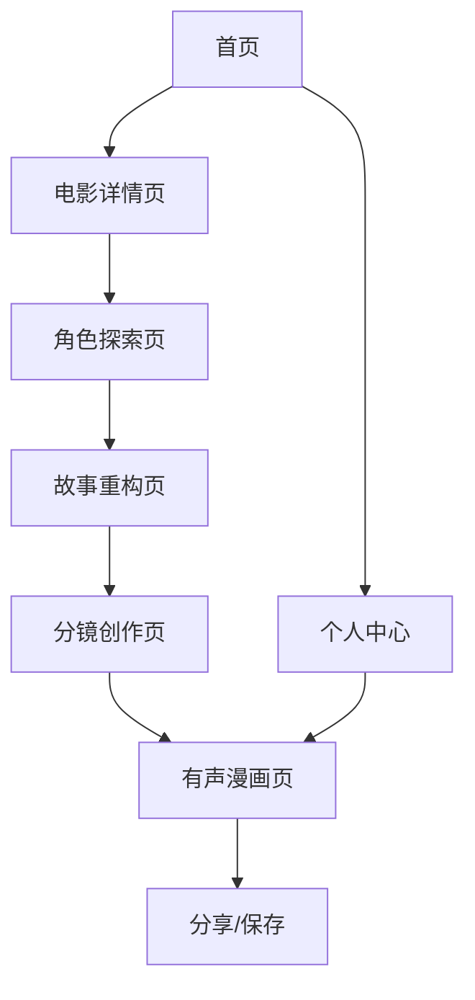

# NPC看电影 - 产品需求文档

## 1. 产品概述

NPC看电影是一款突破性的**用户与AI共创**电影角色互动小程序。用户不再是被动的内容消费者，而是与AI协作的创作伙伴，通过台词分析、性格探讨、故事重构等深度互动，共同创造独特的电影角色解读和个性化有声漫画作品。

- 解决问题：传统观影体验单一，缺乏用户主动参与的创作体验和个性化内容表达
- 目标用户：电影爱好者、内容创作者、追求个性化表达的社交媒体用户
- 产品价值：**开创用户与AI协作创作新模式**，让每个用户都能成为电影内容的共同创作者

## 2. 核心功能

### 2.1 用户角色

| 角色 | 注册方式 | 核心权限 |
|------|----------|----------|
| 普通用户 | 微信授权登录 | 可搜索电影、探索角色、生成基础漫画 |
| 会员用户 | 付费升级 | 无限制使用、高清画质、专属模板、优先处理 |

### 2.2 功能模块

我们的NPC看电影小程序包含以下核心页面：
1. **首页**：电影搜索入口、热门推荐、用户作品展示
2. **电影详情页**：电影梗概展示、角色列表、角色画像
3. **角色探索页**：AI角色对话、性格深挖、特质分析
4. **故事重构页**：人物关系图、故事线梳理、角色独白
5. **分镜创作页**：故事分镜生成、编辑调整、预览功能
6. **有声漫画页**：漫画播放、音效配置、分享设置
7. **个人中心**：作品管理、会员服务、设置选项

### 2.3 页面详情

| 页面名称 | 模块名称 | 功能描述 |
|----------|----------|----------|
| 首页 | 搜索模块 | 电影名称搜索、智能推荐、搜索历史 |
| 首页 | 推荐模块 | 热门电影展示、个性化推荐、分类筛选 |
| 首页 | 作品展示 | 用户作品轮播、点赞收藏、快速分享 |
| 电影详情页 | 电影信息 | 展示电影海报、简介、评分、基本信息 |
| 电影详情页 | 角色列表 | 主要角色展示、角色头像、基础信息 |
| 电影详情页 | 角色画像 | AI生成角色形象、性格标签、关键特征 |
| 角色探索页 | 台词分析 | **用户选择经典台词进行深度解读，与AI共同挖掘角色性格特质** |
| 角色探索页 | AI协作对话 | **用户提出性格观点，AI回应补充，双向深度探讨角色内心** |
| 角色探索页 | 共创特质库 | **用户和AI共同构建角色性格特质标签，支持自定义添加** |
| 故事重构页 | 协作关系图谱 | **用户可调整人物关系连线，AI提供分析建议，共同完善关系网络** |
| 故事重构页 | 互动故事线 | **用户重新排列故事节点，AI协助逻辑检查，共创新故事线** |
| 故事重构页 | 共编角色独白 | **用户编辑角色独白内容，AI提供语言优化和情感深化建议** |
| 分镜创作页 | 协作分镜设计 | **用户修改分镜内容和场景描述，AI提供视觉化建议和创意补充** |
| 分镜创作页 | 个性化定制 | **用户自定义分镜风格、对话内容，AI协助优化视觉呈现效果** |
| 分镜创作页 | 独白生成 | **基于分镜描述和角色特质生成角色内心独白，支持用户编辑和AI优化** |
| 分镜创作页 | 语音合成 | **将独白文本转换为角色语音，支持语速、音调、情感调节** |
| 有声漫画页 | 漫画渲染 | **基于音频时长和分镜设计生成同步的有声漫画内容** |
| 有声漫画页 | 音画同步 | **精确匹配音频节奏与画面切换，确保最佳观看体验** |
| 有声漫画页 | 漫画播放 | 分镜动画播放、转场效果、播放控制 |
| 有声漫画页 | 音效配置 | 背景音乐选择、音效添加、语音合成 |
| 有声漫画页 | 分享功能 | 生成分享海报、朋友圈分享、链接分享 |
| 个人中心 | 作品管理 | 历史作品查看、编辑删除、收藏管理 |
| 个人中心 | 会员服务 | 会员权益展示、升级购买、使用统计 |

## 3. 核心流程

**用户与AI共创流程：**

1. 用户在首页搜索或选择电影
2. 进入电影详情页查看梗概和角色列表
3. 选择感兴趣的角色查看AI生成的角色画像
4. **台词共析阶段**：用户选择经典台词，与AI共同深度解读角色性格
5. **协作探索阶段**：用户提出性格观点，AI回应补充，双向构建角色特质库
6. **共创重构阶段**：用户调整人物关系图和故事线，AI提供逻辑建议和创意补充
7. **协作分镜阶段**：用户个性化定制分镜内容，AI协助优化视觉呈现
8. **独白创作阶段**：基于分镜生成角色独白，用户可编辑，AI提供优化建议
9. **语音合成阶段**：将独白文本转换为角色语音，支持个性化调节
10. **漫画渲染阶段**：基于音频时长和分镜设计生成同步的有声漫画
11. **作品完善阶段**：在有声漫画页配置音效并预览最终共创作品
9. 分享个性化有声漫画到朋友圈或保存到个人中心

## 4. 用户界面设计

### 4.1 设计风格

- **主色调**：深蓝色(#1a237e)和金黄色(#ffc107)，营造电影院的神秘感和温暖感
- **辅助色**：浅灰色(#f5f5f5)背景，白色(#ffffff)卡片
- **按钮样式**：圆角矩形按钮，渐变色效果，微阴影设计
- **字体**：主标题使用苹方-中等，正文使用苹方-常规，字号16px-24px
- **布局风格**：卡片式设计，顶部导航，底部标签栏
- **图标风格**：线性图标配合填充图标，电影胶片元素装饰

### 4.2 页面设计概览

| 页面名称 | 模块名称 | UI元素 |
|----------|----------|--------|
| 首页 | 搜索模块 | 圆角搜索框、搜索图标、语音输入按钮、搜索历史标签 |
| 首页 | 推荐模块 | 横向滚动卡片、电影海报、评分星级、分类标签 |
| 电影详情页 | 电影信息 | 大图背景、毛玻璃效果、信息卡片、渐变遮罩 |
| 电影详情页 | 角色列表 | 圆形头像、角色名称、网格布局、点击动效 |
| 角色探索页 | AI对话 | 聊天气泡、角色头像、打字动效、语音播放按钮 |
| 故事重构页 | 关系图谱 | 节点连线图、动态交互、缩放功能、信息弹窗 |
| 分镜创作页 | 分镜展示 | 漫画分格、拖拽排序、缩略图预览、全屏查看 |
| 有声漫画页 | 播放控制 | 播放按钮、进度条、音量控制、全屏播放 |

### 4.3 响应式设计

产品采用移动端优先设计，专为微信小程序环境优化，支持触摸交互和手势操作。界面适配不同屏幕尺寸，确保在各种设备上都有良好的用户体验。