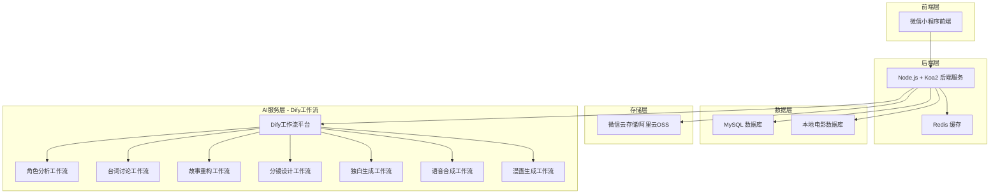
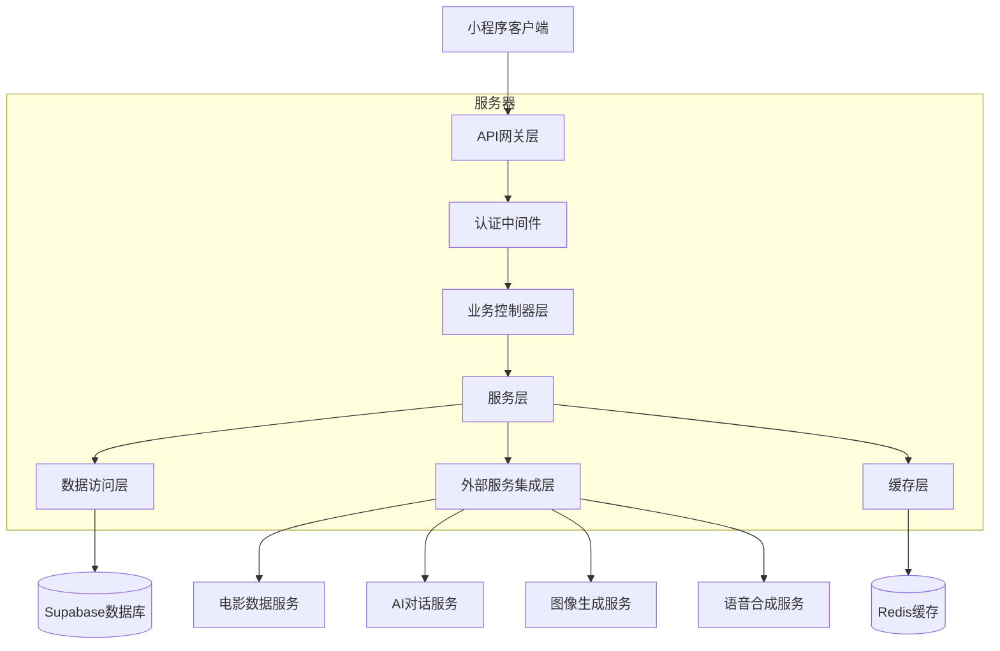
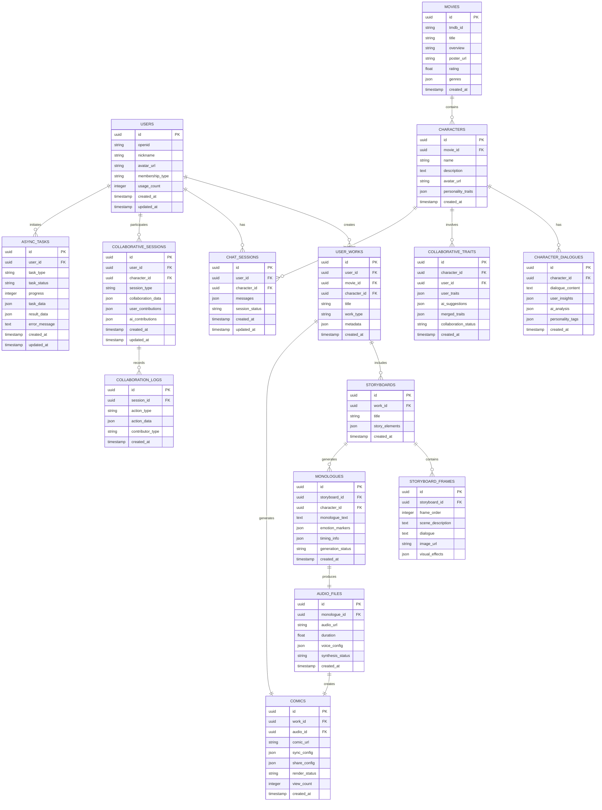

# NPC看电影 - 技术架构文档

## 1. 架构设计



## 2. 技术描述

### 2.1 核心技术栈
- **前端**: 微信小程序原生开发 + Vant Weapp UI组件库
- **后端**: Node.js + Koa2 + TypeScript + Sequelize ORM
- **数据库**: MySQL 8.0+
- **缓存**: Redis 6.0+
- **文件存储**: 微信云存储 + 阿里云OSS

### 2.2 AI服务集成 - Dify工作流架构
- **Dify工作流平台**: 统一的AI服务编排和调用平台
  - 优势：可视化工作流设计，统一API接口，便于管理和维护
  - 架构：通过Dify工作流API调用各种AI能力，程序不直接与大模型交互
- **工作流类型**:
  - 角色分析工作流：基于电影台词和角色信息进行性格分析
  - 台词讨论工作流：用户与AI就角色台词进行深度探讨
  - 故事重构工作流：协助用户重新构建故事线和人物关系
  - 分镜设计工作流：根据故事内容生成分镜脚本
  - 独白生成工作流：基于分镜内容生成角色内心独白
  - 语音合成工作流：将独白文本转换为语音文件
  - 漫画生成工作流：根据分镜描述生成漫画图像

### 2.3 技术选型优势
- **微信小程序原生开发**：性能最优，API支持最全，用户体验最佳
- **Vant Weapp**：微信小程序生态最成熟的UI组件库，组件丰富，文档完善
- **Koa2 + TypeScript**：轻量级框架，中间件机制灵活，TypeScript提供类型安全
- **Sequelize ORM**：Node.js生态最成熟的ORM，支持MySQL，迁移和模型管理便捷
- **MySQL**：关系型数据库，ACID特性保证数据一致性，适合复杂查询
- **Redis**：高性能缓存，支持多种数据结构，适合会话管理和任务队列

## 3. 路由定义

| 路由                      | 用途                |
| ----------------------- | ----------------- |
| pages/index/index       | 首页，电影搜索和推荐展示      |
| pages/movie/detail      | 电影详情页，显示电影信息和角色列表 |
| pages/character/explore | 角色探索页，AI对话和性格分析   |
| pages/story/reconstruct | 故事重构页，人物关系和故事线展示  |
| pages/storyboard/create | 分镜创作页，故事分镜生成和编辑   |
| pages/comic/view        | 有声漫画页，漫画播放和分享     |
| pages/user/profile      | 个人中心，作品管理和会员服务    |
| pages/auth/login        | 登录页，微信授权登录        |

## 4. API定义

### 4.1 核心API

#### 4.1.1 用户认证
```
POST /api/auth/login
```
Request:
| Param Name| Param Type  | isRequired  | Description |
|-----------|-------------|-------------|-------------|
| code      | string      | true        | 微信登录凭证 |

Response:
| Param Name| Param Type  | Description |
|-----------|-------------|-------------|
| token     | string      | JWT token   |
| userInfo  | object      | 用户信息     |

#### 4.1.2 电影数据（本地数据库）
```
GET /api/movies/search
```
Request:
| Param Name| Param Type  | isRequired  | Description |
|-----------|-------------|-------------|-------------|
| keyword   | string      | true        | 电影名称关键词 |

Response:
| Param Name| Param Type  | Description |
|-----------|-------------|-------------|
| movies    | array       | 本地电影数据列表 |

```
GET /api/movies/:id/dialogues
```
Response:
| Param Name| Param Type  | Description |
|-----------|-------------|-------------|
| dialogues | array       | 电影对白数据（本地） |

#### 4.1.3 Dify工作流API集成
```
POST /api/dify/character-analysis
```
调用角色分析工作流

Request:
| Param Name| Param Type  | isRequired  | Description |
|-----------|-------------|-------------|-------------|
| movieId   | string      | true        | 电影ID       |
| characterId| string     | true        | 角色ID       |
| dialogues | array       | true        | 角色台词列表（本地数据） |
| userContext| object     | false       | 用户上下文信息 |

Response:
| Param Name| Param Type  | Description |
|-----------|-------------|-------------|
| workflowId| string      | 工作流执行ID |
| analysis  | object      | 角色分析结果 |
| traits    | array       | 性格特质列表  |
| status    | string      | 执行状态     |

```
POST /api/dify/dialogue-discussion
```
调用台词讨论工作流

Request:
| Param Name| Param Type  | isRequired  | Description |
|-----------|-------------|-------------|-------------|
| characterId| string     | true        | 角色ID       |
| dialogue  | string      | true        | 讨论的台词   |
| userInsight| string     | true        | 用户观点     |
| sessionId | string      | true        | 会话ID       |

Response:
| Param Name| Param Type  | Description |
|-----------|-------------|-------------|
| workflowId| string      | 工作流执行ID |
| aiResponse| string      | AI回应内容   |
| insights  | array       | 深度洞察     |
| status    | string      | 执行状态     |

```
POST /api/dify/story-reconstruct
```
调用故事重构工作流

Request:
| Param Name| Param Type  | isRequired  | Description |
|-----------|-------------|-------------|-------------|
| movieId   | string      | true        | 电影ID       |
| userStoryNodes| array   | true        | 用户故事节点 |
| userRelations| array    | false       | 用户人物关系 |

Response:
| Param Name| Param Type  | Description |
|-----------|-------------|-------------|
| workflowId| string      | 工作流执行ID |
| optimizedStory| object  | 优化后故事结构|
| suggestions| array      | AI建议       |
| status    | string      | 执行状态     |

```
POST /api/dify/storyboard-create
```
调用分镜设计工作流

Request:
| Param Name| Param Type  | isRequired  | Description |
|-----------|-------------|-------------|-------------|
| storyId   | string      | true        | 故事ID       |
| userFrames| array       | true        | 用户分镜内容 |
| stylePrefs| object      | false       | 风格偏好     |

Response:
| Param Name| Param Type  | Description |
|-----------|-------------|-------------|
| workflowId| string      | 工作流执行ID |
| storyboard| object      | 完整分镜脚本 |
| visualSuggestions| array| 视觉建议     |
| status    | string      | 执行状态     |

```
POST /api/dify/monologue-generate
```
调用独白生成工作流

Request:
| Param Name| Param Type  | isRequired  | Description |
|-----------|-------------|-------------|-------------|
| storyboardId| string    | true        | 分镜ID       |
| characterId| string     | true        | 角色ID       |
| frameContext| array     | true        | 分镜上下文   |
| emotionTone| string     | false       | 情感基调     |

Response:
| Param Name| Param Type  | Description |
|-----------|-------------|-------------|
| workflowId| string      | 工作流执行ID |
| monologue | string      | 生成的独白   |
| emotionMarkers| array   | 情感标记     |
| status    | string      | 执行状态     |

```
POST /api/dify/voice-synthesis
```
调用语音合成工作流

Request:
| Param Name| Param Type  | isRequired  | Description |
|-----------|-------------|-------------|-------------|
| monologueId| string     | true        | 独白ID       |
| voiceConfig| object     | true        | 语音配置     |
| character | object      | true        | 角色信息     |

Response:
| Param Name| Param Type  | Description |
|-----------|-------------|-------------|
| workflowId| string      | 工作流执行ID |
| audioUrl  | string      | 音频文件URL  |
| duration  | number      | 音频时长(秒)  |
| status    | string      | 执行状态     |

```
POST /api/dify/comic-generate
```
调用漫画生成工作流

Request:
| Param Name| Param Type  | isRequired  | Description |
|-----------|-------------|-------------|-------------|
| storyboardId| string    | true        | 分镜ID       |
| audioId   | string      | true        | 音频ID       |
| style     | string      | false       | 漫画风格     |
| syncConfig| object      | false       | 同步配置     |

Response:
| Param Name| Param Type  | Description |
|-----------|-------------|-------------|
| workflowId| string      | 工作流执行ID |
| comicUrl  | string      | 漫画访问URL  |
| taskId    | string      | 异步任务ID   |
| status    | string      | 执行状态     |

**台词分析与共创相关**

```
POST /api/characters/dialogue-analysis
```

请求参数:

| 参数名           | 参数类型   | 是否必需 | 描述                    |
| ------------- | ------ | ---- | --------------------- |
| movieId       | string | true | 电影ID                  |
| characterId   | string | true | 角色ID                  |
| dialogue      | string | true | 用户选择的台词内容             |
| userInsight   | string | false | 用户对台词的理解和观点           |

响应:

| 字段名           | 字段类型     | 描述           |
| ------------- | -------- | ------------ |
| success       | boolean  | 请求是否成功       |
| aiAnalysis    | string   | AI对台词的深度分析   |
| personalityTags | string[] | 提取的性格特质标签    |
| collaborativeInsights | object | 用户与AI的协作洞察结果 |

**协作特质构建**

```
POST /api/characters/collaborative-traits
```

请求参数:

| 参数名         | 参数类型     | 是否必需 | 描述         |
| ----------- | -------- | ---- | ---------- |
| characterId | string   | true | 角色ID       |
| userTraits  | string[] | true | 用户提出的性格特质  |
| aiSuggestions | string[] | false | AI建议的补充特质 |

响应:

| 字段名           | 字段类型     | 描述         |
| ------------- | -------- | ---------- |
| success       | boolean  | 请求是否成功     |
| mergedTraits  | object[] | 合并后的特质库    |
| conflictResolution | object | 特质冲突的解决建议  |

**AI对话相关**

```
POST /api/chat/character
```

请求参数:

| 参数名         | 参数类型   | 是否必需 | 描述   |
| ----------- | ------ | ---- | ---- |
| sessionId   | string | true | 会话ID |
| message     | string | true | 用户消息 |
| characterId | string | true | 角色ID |

响应:

| 字段名     | 字段类型    | 描述     |
| ------- | ------- | ------ |
| success | boolean | 请求是否成功 |
| reply   | string  | AI角色回复 |
| emotion | string  | 角色情感状态 |

**故事重构协作**

```
POST /api/story/collaborative-reconstruct
```

请求参数:

| 参数名              | 参数类型   | 是否必需 | 描述           |
| ---------------- | ------ | ---- | ------------ |
| movieId          | string | true | 电影ID         |
| characterId      | string | true | 角色ID         |
| userStoryNodes   | object[] | true | 用户调整的故事节点    |
| userRelationships | object[] | false | 用户修改的人物关系    |
| userMonologue    | string | false | 用户编辑的角色独白内容  |

响应:

| 字段名              | 字段类型     | 描述           |
| ---------------- | -------- | ------------ |
| success          | boolean  | 请求是否成功       |
| aiSuggestions    | object   | AI的逻辑检查和建议   |
| optimizedStory   | object   | 优化后的故事结构     |
| enhancedMonologue | string   | AI优化的角色独白    |

**协作分镜创作**

```
POST /api/storyboard/collaborative-create
```

请求参数:

| 参数名           | 参数类型     | 是否必需 | 描述         |
| ------------- | -------- | ---- | ---------- |
| storyId       | string   | true | 故事ID       |
| userFrames    | object[] | true | 用户定制的分镜内容  |
| stylePreference | object   | false | 用户的风格偏好    |
| customDialogue | string[] | false | 用户自定义的对话内容 |

响应:

| 字段名              | 字段类型     | 描述         |
| ---------------- | -------- | ---------- |
| success          | boolean  | 请求是否成功     |
| enhancedFrames   | object[] | AI优化的分镜帧   |
| visualSuggestions | object[] | 视觉化建议和创意补充 |
| finalStoryboard  | object   | 最终协作完成的分镜  |

**独白生成**

```
POST /api/monologue/generate
```

请求参数:

| 参数名          | 参数类型   | 是否必需 | 描述           |
| ------------ | ------ | ---- | ------------ |
| storyboardId | string | true | 分镜ID         |
| characterId  | string | true | 角色ID         |
| frameContext | object[] | true | 分镜上下文信息      |
| emotionTone  | string | false | 情感基调         |

响应:

| 字段名           | 字段类型     | 描述         |
| ------------- | -------- | ---------- |
| success       | boolean  | 请求是否成功     |
| monologueText | string   | 生成的独白文本    |
| emotionMarkers | object[] | 情感标记点      |
| timingInfo   | object   | 时长和节奏信息    |

**语音合成**

```
POST /api/audio/synthesize
```

请求参数:

| 参数名         | 参数类型   | 是否必需 | 描述       |
| ----------- | ------ | ---- | -------- |
| monologueId | string | true | 独白ID     |
| voiceConfig | object | true | 语音配置参数   |
| speedRate   | float  | false | 语速，默认1.0 |
| pitchRate   | float  | false | 音调，默认1.0 |

响应:

| 字段名        | 字段类型    | 描述       |
| ---------- | ------- | -------- |
| success    | boolean | 请求是否成功   |
| audioUrl   | string  | 音频文件URL  |
| duration   | float   | 音频时长(秒)  |
| audioId    | string  | 音频文件ID   |

**有声漫画生成**

```
POST /api/comic/generate
```

请求参数:

| 参数名          | 参数类型   | 是否必需  | 描述     |
| ------------ | ------ | ----- | ------ |
| storyboardId | string | true  | 分镜ID   |
| audioId      | string | true  | 音频文件ID |
| styleConfig  | object | false | 样式配置   |
| syncConfig   | object | false | 音画同步配置 |

响应:

| 字段名         | 字段类型    | 描述       |
| ----------- | ------- | -------- |
| success     | boolean | 请求是否成功   |
| comicUrl    | string  | 有声漫画访问链接 |
| shareConfig | object  | 分享配置信息   |
| renderStatus | string  | 渲染状态     |

**异步任务状态查询**

```
GET /api/tasks/status/{taskId}
```

响应:

| 字段名        | 字段类型    | 描述                           |
| ---------- | ------- | ---------------------------- |
| success    | boolean | 请求是否成功                       |
| status     | string  | 任务状态: pending/processing/completed/failed |
| progress   | number  | 进度百分比                        |
| result     | object  | 任务完成后的结果                     |
| error      | string  | 错误信息(如果失败)                   |

## 5. 服务器架构图



## 6. 数据模型

### 6.1 数据模型定义



### 6.2 数据定义语言

**用户表 (users)**

```sql
-- 创建用户表
CREATE TABLE users (
    id VARCHAR(36) PRIMARY KEY DEFAULT (UUID()),
    openid VARCHAR(100) UNIQUE NOT NULL COMMENT '微信openid',
    nickname VARCHAR(50) COMMENT '用户昵称',
    avatar_url TEXT COMMENT '头像URL',
    membership_type ENUM('free', 'premium') DEFAULT 'free' COMMENT '会员类型',
    created_at TIMESTAMP DEFAULT CURRENT_TIMESTAMP COMMENT '创建时间',
    updated_at TIMESTAMP DEFAULT CURRENT_TIMESTAMP ON UPDATE CURRENT_TIMESTAMP COMMENT '更新时间',
    INDEX idx_openid (openid),
    INDEX idx_membership (membership_type)
) ENGINE=InnoDB DEFAULT CHARSET=utf8mb4 COLLATE=utf8mb4_unicode_ci COMMENT='用户表';
```

**电影表 (movies)**

```sql
-- 创建电影表（本地数据）
CREATE TABLE movies (
    id VARCHAR(36) PRIMARY KEY DEFAULT (UUID()),
    title VARCHAR(200) NOT NULL COMMENT '电影标题',
    original_title VARCHAR(200) COMMENT '原始标题',
    overview TEXT COMMENT '电影简介',
    release_date DATE COMMENT '上映日期',
    poster_url TEXT COMMENT '海报URL',
    backdrop_url TEXT COMMENT '背景图URL',
    director VARCHAR(100) COMMENT '导演',
    genre_ids JSON COMMENT '类型ID数组',
    rating DECIMAL(3,1) COMMENT '评分',
    duration INT COMMENT '时长(分钟)',
    created_at TIMESTAMP DEFAULT CURRENT_TIMESTAMP,
    updated_at TIMESTAMP DEFAULT CURRENT_TIMESTAMP ON UPDATE CURRENT_TIMESTAMP,
    INDEX idx_title (title),
    INDEX idx_release_date (release_date DESC),
    INDEX idx_rating (rating DESC),
    FULLTEXT idx_title_overview (title, overview)
) ENGINE=InnoDB DEFAULT CHARSET=utf8mb4 COLLATE=utf8mb4_unicode_ci COMMENT='电影表（本地数据）';
```

**角色表 (characters)**

```sql
-- 创建角色表
CREATE TABLE characters (
    id VARCHAR(36) PRIMARY KEY DEFAULT (UUID()),
    movie_id VARCHAR(36) NOT NULL COMMENT '电影ID',
    name VARCHAR(100) NOT NULL COMMENT '角色名称',
    description TEXT COMMENT '角色描述',
    actor VARCHAR(100) COMMENT '演员姓名',
    image_url TEXT COMMENT '角色图片URL',
    importance_level INT DEFAULT 1 COMMENT '重要程度(1-5)',
    dialogue_count INT DEFAULT 0 COMMENT '台词数量',
    created_at TIMESTAMP DEFAULT CURRENT_TIMESTAMP,
    updated_at TIMESTAMP DEFAULT CURRENT_TIMESTAMP ON UPDATE CURRENT_TIMESTAMP,
    INDEX idx_movie_id (movie_id),
    INDEX idx_name (name),
    INDEX idx_importance (importance_level DESC),
    FOREIGN KEY (movie_id) REFERENCES movies(id) ON DELETE CASCADE
) ENGINE=InnoDB DEFAULT CHARSET=utf8mb4 COLLATE=utf8mb4_unicode_ci COMMENT='角色表';
```

**用户作品表 (user\_works)**

```sql
-- 创建用户作品表
CREATE TABLE user_works (
    id UUID PRIMARY KEY DEFAULT gen_random_uuid(),
    user_id UUID REFERENCES users(id),
    movie_id UUID REFERENCES movies(id),
    character_id UUID REFERENCES characters(id),
    title VARCHAR(200) NOT NULL,
    work_type VARCHAR(50) NOT NULL CHECK (work_type IN ('comic', 'storyboard', 'analysis')),
    metadata JSONB,
    created_at TIMESTAMP WITH TIME ZONE DEFAULT NOW()
);

-- 创建索引
CREATE INDEX idx_user_works_user_id ON user_works(user_id);
CREATE INDEX idx_user_works_created_at ON user_works(created_at DESC);

-- 权限设置
GRANT SELECT ON user_works TO anon;
GRANT ALL PRIVILEGES ON user_works TO authenticated;
```

**独白表 (monologues)**

```sql
-- 创建独白表
CREATE TABLE monologues (
    id UUID PRIMARY KEY DEFAULT gen_random_uuid(),
    storyboard_id UUID REFERENCES storyboards(id),
    character_id UUID REFERENCES characters(id),
    monologue_text TEXT NOT NULL,
    emotion_markers JSONB,
    timing_info JSONB,
    generation_status VARCHAR(20) DEFAULT 'pending' CHECK (generation_status IN ('pending', 'processing', 'completed', 'failed')),
    created_at TIMESTAMP WITH TIME ZONE DEFAULT NOW()
);

-- 创建索引
CREATE INDEX idx_monologues_storyboard_id ON monologues(storyboard_id);
CREATE INDEX idx_monologues_character_id ON monologues(character_id);
CREATE INDEX idx_monologues_status ON monologues(generation_status);

-- 权限设置
GRANT SELECT ON monologues TO anon;
GRANT ALL PRIVILEGES ON monologues TO authenticated;
```

**音频文件表 (audio_files)**

```sql
-- 创建音频文件表
CREATE TABLE audio_files (
    id VARCHAR(36) PRIMARY KEY DEFAULT (UUID()),
    monologue_id VARCHAR(36) NOT NULL COMMENT '独白ID',
    audio_url TEXT NOT NULL COMMENT '音频文件URL',
    file_size INT COMMENT '文件大小(字节)',
    duration DECIMAL(8,2) NOT NULL COMMENT '音频时长(秒)',
    format VARCHAR(10) DEFAULT 'mp3' COMMENT '音频格式',
    voice_config JSON COMMENT '语音配置',
    synthesis_status ENUM('pending', 'processing', 'completed', 'failed') DEFAULT 'pending' COMMENT '合成状态',
    error_message TEXT COMMENT '错误信息',
    created_at TIMESTAMP DEFAULT CURRENT_TIMESTAMP,
    updated_at TIMESTAMP DEFAULT CURRENT_TIMESTAMP ON UPDATE CURRENT_TIMESTAMP,
    INDEX idx_monologue_id (monologue_id),
    INDEX idx_synthesis_status (synthesis_status),
    INDEX idx_duration (duration),
    INDEX idx_created_at (created_at DESC),
    FOREIGN KEY (monologue_id) REFERENCES monologues(id) ON DELETE CASCADE
) ENGINE=InnoDB DEFAULT CHARSET=utf8mb4 COLLATE=utf8mb4_unicode_ci COMMENT='音频文件表';
```

**异步任务表 (async_tasks)**

```sql
-- 创建异步任务表
CREATE TABLE async_tasks (
    id VARCHAR(36) PRIMARY KEY DEFAULT (UUID()),
    user_id VARCHAR(36) NOT NULL COMMENT '用户ID',
    task_type ENUM('monologue_generation', 'audio_synthesis', 'comic_rendering') NOT NULL COMMENT '任务类型',
    task_status ENUM('pending', 'processing', 'completed', 'failed') DEFAULT 'pending' COMMENT '任务状态',
    progress INT DEFAULT 0 COMMENT '进度百分比(0-100)',
    task_data JSON COMMENT '任务数据',
    result_data JSON COMMENT '结果数据',
    error_message TEXT COMMENT '错误信息',
    priority INT DEFAULT 5 COMMENT '优先级(1-10)',
    retry_count INT DEFAULT 0 COMMENT '重试次数',
    max_retries INT DEFAULT 3 COMMENT '最大重试次数',
    started_at TIMESTAMP NULL COMMENT '开始时间',
    completed_at TIMESTAMP NULL COMMENT '完成时间',
    created_at TIMESTAMP DEFAULT CURRENT_TIMESTAMP,
    updated_at TIMESTAMP DEFAULT CURRENT_TIMESTAMP ON UPDATE CURRENT_TIMESTAMP,
    INDEX idx_user_id (user_id),
    INDEX idx_task_status (task_status),
    INDEX idx_task_type (task_type),
    INDEX idx_priority (priority DESC),
    INDEX idx_created_at (created_at DESC),
    FOREIGN KEY (user_id) REFERENCES users(id) ON DELETE CASCADE
) ENGINE=InnoDB DEFAULT CHARSET=utf8mb4 COLLATE=utf8mb4_unicode_ci COMMENT='异步任务表';
```

**更新漫画表 (comics)**

```sql
-- 更新漫画表结构
ALTER TABLE comics ADD COLUMN audio_id UUID REFERENCES audio_files(id);
ALTER TABLE comics ADD COLUMN sync_config JSONB;
ALTER TABLE comics ADD COLUMN render_status VARCHAR(20) DEFAULT 'pending' CHECK (render_status IN ('pending', 'processing', 'completed', 'failed'));
ALTER TABLE comics RENAME COLUMN audio_config TO sync_config_old;

-- 创建新索引
CREATE INDEX idx_comics_audio_id ON comics(audio_id);
CREATE INDEX idx_comics_render_status ON comics(render_status);

-- 权限设置保持不变
```

**初始化数据**

```sql
-- 插入示例电影数据
INSERT INTO movies (tmdb_id, title, overview, poster_url, rating, genres) VALUES
('550', '搏击俱乐部', '一个失眠的白领和一个制造肥皂的商人组建了一个地下搏击俱乐部，后来发展成了一个无政府主义组织。', 'https://image.tmdb.org/t/p/w500/pB8BM7pdSp6B6Ih7QZ4DrQ3PmJK.jpg', 8.8, '["剧情", "惊悚"]'),
('13', '阿甘正传', '阿甘是一个智商只有75的男孩，但他善良单纯，最终获得了成功和幸福。', 'https://image.tmdb.org/t/p/w500/saHP97rTPS5eLmrLQEcANmKrsFl.jpg', 8.8, '["剧情", "爱情"]');

-- 插入示例角色数据
INSERT INTO characters (movie_id, name, description, personality_traits) VALUES
((SELECT id FROM movies WHERE tmdb_id = '550'), '泰勒·德顿', '神秘的肥皂制造商，搏击俱乐部的创始人', '{"traits": ["叛逆", "魅力", "危险", "自由"]}'),
((SELECT id FROM movies WHERE tmdb_id = '13'), '阿甘', '善良单纯的男主角，智商不高但心地善良', '{"traits": ["善良", "单纯", "坚持", "乐观"]}');
```

## 7. Dify工作流集成方案

### 7.1 Dify工作流架构设计

**核心配置**
```javascript
// config/dify.js
const difyConfig = {
  baseURL: process.env.DIFY_API_BASE_URL || 'https://api.dify.ai/v1',
  apiKey: process.env.DIFY_API_KEY,
  workflows: {
    characterAnalysis: process.env.DIFY_WORKFLOW_CHARACTER_ANALYSIS,
    dialogueDiscussion: process.env.DIFY_WORKFLOW_DIALOGUE_DISCUSSION,
    storyReconstruct: process.env.DIFY_WORKFLOW_STORY_RECONSTRUCT,
    storyboardDesign: process.env.DIFY_WORKFLOW_STORYBOARD_DESIGN,
    monologueGeneration: process.env.DIFY_WORKFLOW_MONOLOGUE_GENERATION,
    comicGeneration: process.env.DIFY_WORKFLOW_COMIC_GENERATION
  },
  timeout: 30000,
  retryAttempts: 3
};
```

**统一工作流服务**
```javascript
// services/difyWorkflowService.js
class DifyWorkflowService {
  constructor() {
    this.baseURL = difyConfig.baseURL;
    this.apiKey = difyConfig.apiKey;
    this.workflows = difyConfig.workflows;
  }

  async executeWorkflow(workflowType, inputs, options = {}) {
    const workflowId = this.workflows[workflowType];
    if (!workflowId) {
      throw new Error(`Workflow type ${workflowType} not configured`);
    }

    const response = await fetch(`${this.baseURL}/workflows/${workflowId}/run`, {
      method: 'POST',
      headers: {
        'Authorization': `Bearer ${this.apiKey}`,
        'Content-Type': 'application/json'
      },
      body: JSON.stringify({
        inputs,
        response_mode: options.async ? 'streaming' : 'blocking',
        user: options.userId || 'anonymous'
      })
    });

    if (!response.ok) {
      throw new Error(`Dify workflow execution failed: ${response.statusText}`);
    }

    return response.json();
  }

  // 角色分析工作流
  async analyzeCharacter(movieId, characterId, dialogues, userInsights = '') {
    return await this.executeWorkflow('characterAnalysis', {
      movie_id: movieId,
      character_id: characterId,
      dialogues: dialogues.join('\n'),
      user_insights: userInsights
    });
  }

  // 台词讨论工作流
  async discussDialogue(characterId, dialogue, userPerspective) {
    return await this.executeWorkflow('dialogueDiscussion', {
      character_id: characterId,
      dialogue_text: dialogue,
      user_perspective: userPerspective
    });
  }

  // 故事重构工作流
  async reconstructStory(movieId, userStoryNodes, userRelationships) {
    return await this.executeWorkflow('storyReconstruct', {
      movie_id: movieId,
      user_story_nodes: JSON.stringify(userStoryNodes),
      user_relationships: JSON.stringify(userRelationships)
    });
  }

  // 分镜设计工作流
  async designStoryboard(storyId, userFrames, stylePreference) {
    return await this.executeWorkflow('storyboardDesign', {
      story_id: storyId,
      user_frames: JSON.stringify(userFrames),
      style_preference: JSON.stringify(stylePreference)
    });
  }

  // 独白生成工作流
  async generateMonologue(storyboardId, characterId, frameContext, emotionTone) {
    return await this.executeWorkflow('monologueGeneration', {
      storyboard_id: storyboardId,
      character_id: characterId,
      frame_context: JSON.stringify(frameContext),
      emotion_tone: emotionTone
    });
  }

  // 漫画生成工作流
  async generateComic(storyboardId, audioId, styleConfig, syncConfig) {
    return await this.executeWorkflow('comicGeneration', {
      storyboard_id: storyboardId,
      audio_id: audioId,
      style_config: JSON.stringify(styleConfig),
      sync_config: JSON.stringify(syncConfig)
    }, { async: true });
  }
}
```

### 7.2 各工作流集成实现

**角色分析工作流**
```javascript
// services/characterService.js
class CharacterService {
  constructor(difyService) {
    this.difyService = difyService;
  }

  async analyzeCharacter(movieId, characterId, dialogues, userContext = {}) {
    const inputs = {
      movie_id: movieId,
      character_id: characterId,
      dialogues: dialogues.join('\n'),
      user_context: JSON.stringify(userContext)
    };

    const result = await this.difyService.callWorkflow('characterAnalysis', inputs);
    
    return {
      workflowId: result.workflow_run_id,
      analysis: result.data.analysis,
      traits: result.data.traits,
      status: result.status
    };
  }
}
```

**台词讨论工作流**
```javascript
// services/dialogueService.js
class DialogueService {
  constructor(difyService) {
    this.difyService = difyService;
  }

  async discussDialogue(characterId, dialogue, userInsight, sessionId) {
    const inputs = {
      character_id: characterId,
      dialogue: dialogue,
      user_insight: userInsight,
      session_id: sessionId
    };

    const result = await this.difyService.callWorkflow('dialogueDiscussion', inputs);
    
    return {
      workflowId: result.workflow_run_id,
      aiResponse: result.data.ai_response,
      insights: result.data.insights,
      status: result.status
    };
  }
}
```

**语音合成工作流**
```javascript
// services/voiceService.js
class VoiceService {
  constructor(difyService) {
    this.difyService = difyService;
  }

  async synthesizeVoice(monologueId, voiceConfig, character) {
    const inputs = {
      monologue_id: monologueId,
      voice_config: JSON.stringify(voiceConfig),
      character_info: JSON.stringify(character)
    };

    const result = await this.difyService.callWorkflow('voiceSynthesis', inputs);
    
    return {
      workflowId: result.workflow_run_id,
      audioUrl: result.data.audio_url,
      duration: result.data.duration,
      status: result.status
    };
  }
}
```

### 7.3 工作流状态管理

**异步任务处理**
```javascript
// services/workflowManager.js
class WorkflowManager {
  constructor(difyService, redisClient) {
    this.difyService = difyService;
    this.redis = redisClient;
  }

  async trackWorkflowStatus(workflowId, taskId) {
    // 将工作流ID与任务ID关联
    await this.redis.setex(`workflow:${workflowId}`, 3600, taskId);
    
    // 定期检查工作流状态
    const checkStatus = async () => {
      try {
        const status = await this.getWorkflowStatus(workflowId);
        await this.updateTaskStatus(taskId, status);
        
        if (status.status === 'completed' || status.status === 'failed') {
          return;
        }
        
        // 继续检查
        setTimeout(checkStatus, 5000);
      } catch (error) {
        console.error('Workflow status check failed:', error);
      }
    };
    
    checkStatus();
  }

  async getWorkflowStatus(workflowId) {
    const response = await fetch(`${this.difyService.baseURL}/workflows/${workflowId}/status`, {
      headers: {
        'Authorization': `Bearer ${this.difyService.apiKey}`
      }
    });
    
    return response.json();
  }
}
```

### 7.4 错误处理和重试机制

**工作流调用封装**
```javascript
// utils/workflowWrapper.js
class WorkflowWrapper {
  constructor(difyService, maxRetries = 3) {
    this.difyService = difyService;
    this.maxRetries = maxRetries;
  }

  async callWithRetry(workflowType, inputs, user = 'system') {
    let lastError;
    
    for (let attempt = 1; attempt <= this.maxRetries; attempt++) {
      try {
        const result = await this.difyService.callWorkflow(workflowType, inputs, user);
        return result;
      } catch (error) {
        lastError = error;
        console.warn(`Workflow ${workflowType} attempt ${attempt} failed:`, error.message);
        
        if (attempt < this.maxRetries) {
          // 指数退避
          const delay = Math.pow(2, attempt) * 1000;
          await new Promise(resolve => setTimeout(resolve, delay));
        }
      }
    }
    
    throw new Error(`Workflow ${workflowType} failed after ${this.maxRetries} attempts: ${lastError.message}`);
  }
}
```

### 7.5 本地电影数据集成

**数据导入脚本**
```javascript
// scripts/importMovieData.js
class MovieDataImporter {
  async importFromLocal(dataPath) {
    const movieData = await this.readLocalData(dataPath);
    
    for (const movie of movieData) {
      // 导入电影基本信息
      await this.importMovie(movie);
      
      // 导入角色信息
      await this.importCharacters(movie.characters);
      
      // 导入对白数据
      await this.importDialogues(movie.dialogues);
    }
  }
  
  async importDialogues(dialogues) {
    // 批量导入对白，支持场景分析和情感标注
    const batchSize = 1000;
    for (let i = 0; i < dialogues.length; i += batchSize) {
      const batch = dialogues.slice(i, i + batchSize);
      await this.batchInsertDialogues(batch);
    }
  }
}
```

**环境变量配置示例**
```bash
# .env
DIFY_API_BASE_URL=https://api.dify.ai/v1
DIFY_API_KEY=your_dify_api_key
DIFY_WORKFLOW_CHARACTER_ANALYSIS=workflow_id_1
DIFY_WORKFLOW_DIALOGUE_DISCUSSION=workflow_id_2
DIFY_WORKFLOW_STORY_RECONSTRUCT=workflow_id_3
DIFY_WORKFLOW_STORYBOARD_CREATE=workflow_id_4
DIFY_WORKFLOW_MONOLOGUE_GENERATE=workflow_id_5
DIFY_WORKFLOW_VOICE_SYNTHESIS=workflow_id_6
DIFY_WORKFLOW_COMIC_GENERATE=workflow_id_7
```
```

